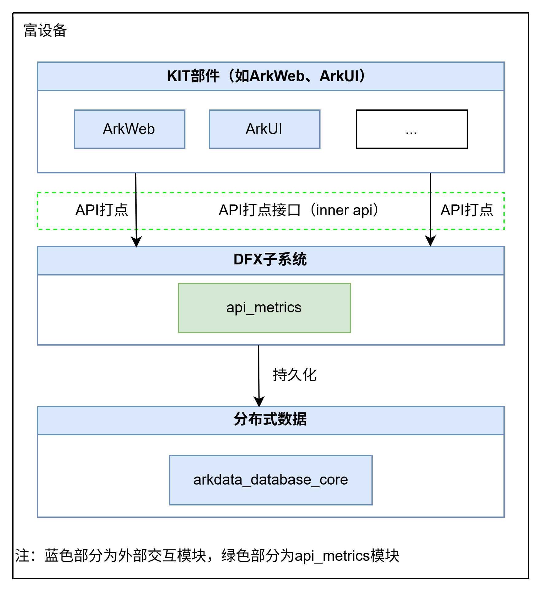
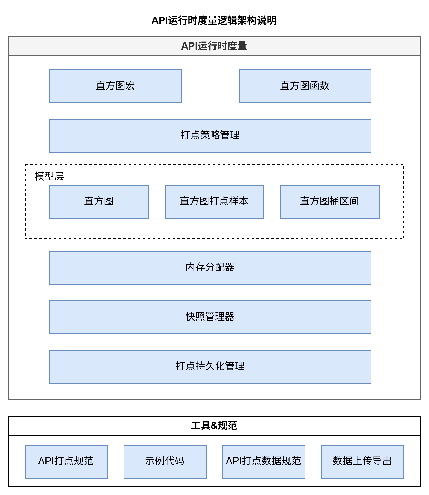

# hiviewdfx_api_metrics
 	 
   ## 简介
   API Metrics SIG仓，提供支持API直方图高性能低功耗打点功能，提供了计数、枚举、时间、百分比、布尔五种直方图，用于度量API运行时调用情况、性能指标。例如业务需要统计某个API的调用次数，可以选择计数直方图；需要统计API不同错误码的出现次数，可以使用枚举直方图。直方图具体使用规范可以参考：[打点规范](https://gitcode.com/openharmony-sig/hiviewdfx_api_metrics/blob/master/Guide.md)

   ## 系统架构
   
   - 提供API运行时打点的规范、云侧上传规范、接口说明、示例代码
   - 提供直方图打点接口能力（inner API）
   - 支持基于典型直方图模型进行数据打点（布尔直方图、枚举直方图、计数直方图、时间统计模型）
   - 支持直方图统计数据本地持久化
   - 支持设备范围：富设备

   
   - 打点策略管理：支持API打点项的新增、废弃管理，1阶段支持通过代码仓配置打点策略，2阶段支持云控制
   - 模型层：提供直方图、分桶区间、打点样本三个类型数据结构
   - 快照管理器：收集直方图数据，统计数据的增量，并将其记录在缓存中
   - 内存分配器：用于多进程共享内存分配和直方图模型内存分配
   - 打点持久化管理：基于持久化策略触发缓存中的统计数据持久化到本地数据库中，定期对数据库中的打点数据进行老化处理


   ## 目录
   项目目录结构如下：
 ```	 
 hiviewdfx_api_metrices/	 
 ├── BUILD.gn                      # 项目构建配置	 
 ├── bundle.json                   # Bundle配置	 
 ├── hiviewdfx.gni                 # GN构建入口	 
 ├── manager/	 
 │   ├── histogram/               # 直方图核心实现	 
 │   │   ├── include/	 
 │   │   │   ├── bucket_ranges.h          # 桶范围定义（线性/指数分桶）	 
 │   │   │   ├── histogram_base.h         # 直方图抽象基类	 
 │   │   │   └── shared_histogram.h       # 5种直方图类定义	 
 │   │   └── src/	 
 │   │       ├── bucket_ranges.cpp        # 桶范围实现	 
 │   │       ├── histogram_base.cpp       # 基类空实现	 
 │   │       └── shared_histogram.cpp     # 5种直方图实现	 
 │   └── innerkits/               # 插件接口层	 
 │       ├── include/	 
 │       │   ├── histogram_plugin_macros.h # 直方图宏(现为内联函数)	 
 │       │   ├── ihistogram_plugin.h       # 插件接口定义	 
 │       │   ├── log_wrapper.h             # 日志封装	 
 │       │   ├── plugin_interface.h        # 插件接口类	 
 │       │   └── plugin_manager.h          # 插件管理器	 
 │       └── src/	 
 │           ├── plugin_interface.cpp      # 插件接口实现	 
 │           └── plugin_manager.cpp        # 插件加载管理	 
 └── test/                        # 测试demo目录	 
 ```


   ## 编译构建
   **命令行编译**

   先进入编译路径
   ```
   cd code
   ```
   在code目录中执行编译命令
   ```
   ./build.sh --product-name rk3568 --ccache --build-target api_metrics --target-cpu arm
   ```
   - 说明： --product-name: 产品名称，例如 rk3568、Hi3516DV300 等。 --ccache: 编译时使用缓存功能。 --build-target: 编译的部件名称，本部件名称为api_metrics。
   ## 使用说明
   打点规范的使用说明请参考：[打点规范](https://gitcode.com/openharmony-sig/hiviewdfx_api_metrics/blob/master/Guide.md)

   ## 许可说明
   参见对应目录的LICENSE文件及代码声明