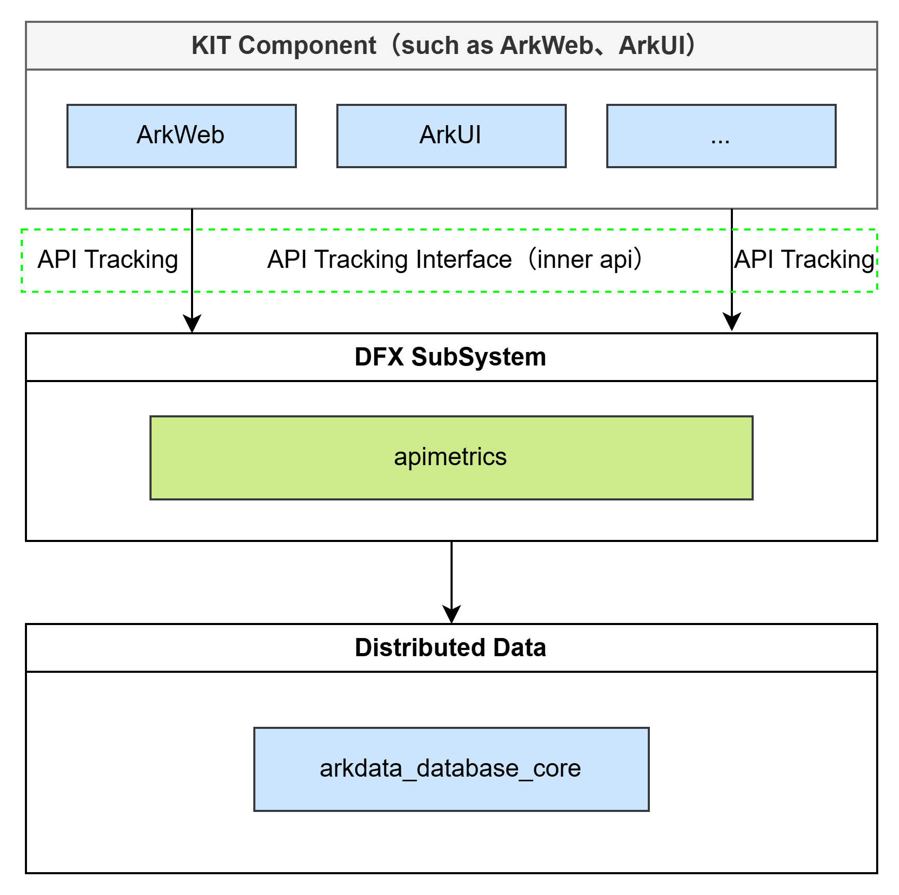
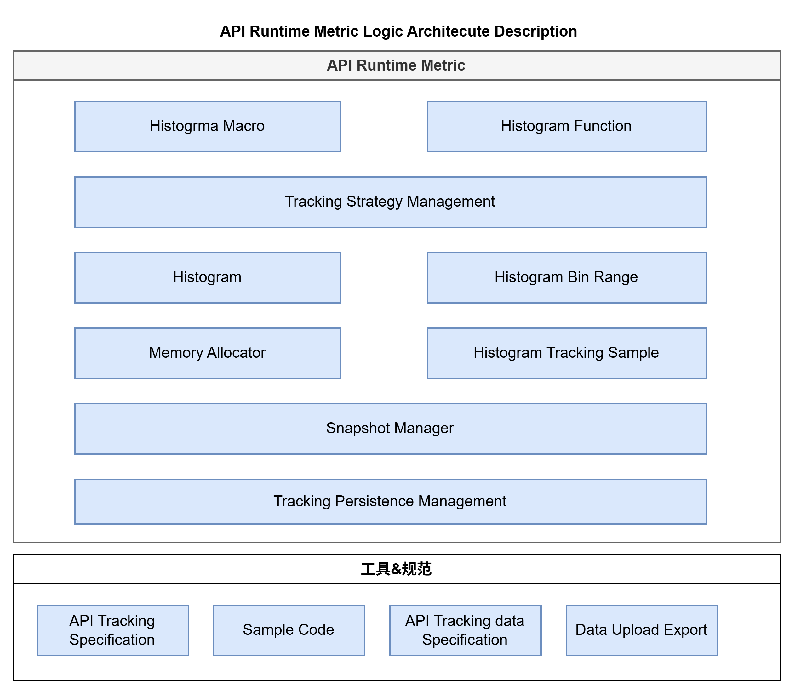

# hiviewdfx_api_metrics

API Metrics SIG repository, providing high-performance low-power metric recording capabilities for API histograms. Supports five histogram types: count, enumeration, timing, percentage, and boolean.

# Directory Structure
```
├── BUILD.gn # Project build configuration
├── bundle.json # Bundle configuration
├── hiviewdfx.gni # GN build entry
├── manager/
│ ├── histogram/ # Core histogram implementation
│ │ ├── include/
│ │ │ ├── bucket_ranges.h # Bucket range definitions (linear/exponential)
│ │ │ ├── histogram_base.h # Abstract base class for histograms
│ │ │ └── shared_histogram.h # Definitions for 5 histogram classes
│ │ └── src/
│ │ ├── bucket_ranges.cpp # Bucket range implementation
│ │ ├── histogram_base.cpp # Base class empty implementation
│ │ └── shared_histogram.cpp # Implementation of 5 histogram types
│ └── innerkits/ # Plugin interface layer
│ ├── include/
│ │ ├── histogram_plugin_macros.h # Histogram macros (now inline functions)
│ │ ├── ihistogram_plugin.h # Plugin interface definition
│ │ ├── log_wrapper.h # Log wrapper
│ │ ├── plugin_interface.h # Plugin interface class
│ │ └── plugin_manager.h # Plugin manager
│ └── src/
│ ├── plugin_interface.cpp # Plugin interface implementation
│ └── plugin_manager.cpp # Plugin loading management
└── test/ # Test demo directory
```

# Repository Features & Logical Architecture

- Provides specifications for API runtime metrics, cloud upload standards, interface documentation, and sample code
- Delivers histogram metric recording interface capabilities (inner API)
- Supports metric data model caching based on typical statistical models (boolean, enumeration, count, timing)
- Supports local persistence of histogram statistics
- Supported device scope: Rich devices



- **API Layer**: Provides C interfaces for other subsystem modules. Additional macro interfaces for histograms deliver higher performance. (ArkTS, Cangjie interfaces have lower priority)
  
- **Metric Strategy Management**: Supports addition/deprecation management of API metrics. Phase 1 supports configuration via code repository, Phase 2 supports cloud control
  
- **Model Layer**: Provides three data structure types: histogram, bucket ranges, and metric samples
  
- **Snapshot Manager**: Collects histogram data, prepares increments, and records them in cache
- **Memory Allocator**: Used for shared memory allocation across processes and histogram model memory allocation
- **Metric Persistence Management**: Triggers persistence of cached statistics to local database based on retention policies. Regularly ages out metric data in the database

# Metric Specification 
For detailed specifications, see: [Metric Standards](https://gitcode.com/Bigdemon/hiviewdfx_api_metrics/edit/master/standard.md)

# License Information
Refer to LICENSE files and code declarations in corresponding directories
